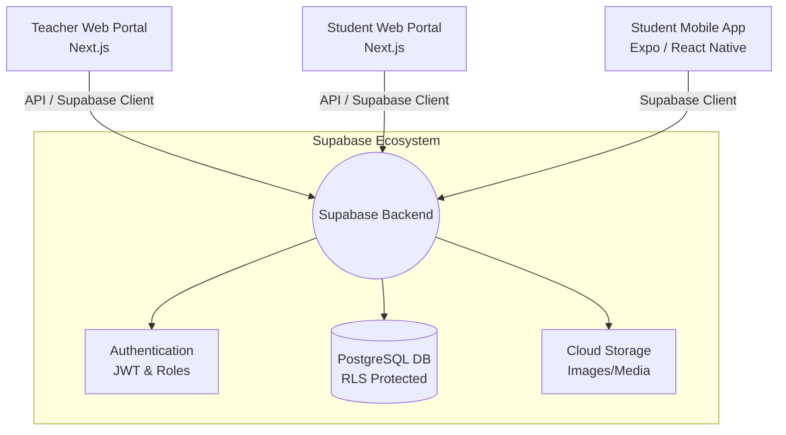

<div align="center">

# 🚀 Xpert

**A production-oriented online examination platform for independent teachers to create, conduct, evaluate, and manage examinations across Web and Mobile.**

[](https://nextjs.org/)
[](https://expo.dev/)
[](https://supabase.com/)
[](https://www.typescriptlang.org/)
[](https://opensource.org/licenses/MIT)


</div>

---

## 📖 Table of Contents

- [Overview](#-overview)
- [Why Xpert?](#-why-xpert)
- [Features](#-features)
- [Architecture](#-architecture)
- [Tech Stack](#-tech-stack)
- [Database Design](#-database-design)
- [Screenshots](#-screenshots)
- [Project Structure](#-project-structure)
- [Getting Started](#-getting-started)
- [Environment Variables](#-environment-variables)
- [Roadmap](#-roadmap)
- [Contributing](#-contributing)
- [License](#-license)

---

## 📌 Overview

**Xpert** is an online examination platform designed specifically for **independent teachers** who want to conduct digital examinations without relying on messy spreadsheets, paper-based evaluations, or expensive, bloated LMS platforms. 

The ecosystem consists of:
- 🌐 **Teacher Web Portal** (Dashboard for creation & management)
- 💻 **Student Web Portal** (For taking exams on desktop)
- 📱 **Student Mobile Application** (For taking exams on the go)
- ☁️ **Shared Supabase Backend** (Unified database & authentication)

---

## 🎯 Why Xpert?

Many independent teachers and tutors still manage their operations manually:
- ❌ Tracking student batches in spreadsheets
- ❌ Distributing question papers via Word/PDF files in chat groups
- ❌ Checking and grading papers by hand
- ❌ Compiling results manually

**Xpert centralizes this entire workflow into a single, seamless digital platform.**

---

## ✨ Features

### 🔐 Authentication & Security
- **Role-based Access:** Distinct portals for Teachers and Students.
- **Secure Dashboard:** Protected routes via Supabase Auth and JWT.
- **Data Privacy:** Strict Row Level Security (RLS) policies.
- **Exam Integrity:** Duplicate submission prevention.

### 👥 Batch Management
- **Easy Enrollment:** Students join via unique batch codes.
- **Centralized Control:** Manage student rosters and batch details from one place.

### 📝 Examination System
- **Rich Question Formats:** MCQ, True/False, Numerical, Theoretical.
- **Media Support:** Image-based questions and options.
- **Advanced Controls:**
  - Per-question timers
  - "No Reverse Back" mode
  - Automatic test submission
- **Smart Grading:** Server-side evaluation with positive & negative marking support.

### 📊 Results & Analytics
- **Instant Scoring:** Automatic evaluation of objective questions.
- **Detailed Breakdowns:** Question-by-question performance reviews.
- **Comprehensive Dashboards:** Separate analytics views for teachers and students.
- **Exporting:** PDF result generation.

---

## 🏗️ Architecture



---

## 🛠 Tech Stack

| Domain | Technologies |
| :--- | :--- |
| **Frontend Web** | Next.js 15, React, TypeScript, Tailwind CSS |
| **Mobile App** | Expo (SDK 54), React Native, TypeScript |
| **Backend & DB** | Supabase, PostgreSQL |
| **Authentication** | Supabase Auth, JWT, Row Level Security (RLS) |
| **Deployment** | Vercel (Web), Render (APIs/Workers if applicable) |

---

## 🗄 Database Design

A high-level overview of the relational structure:

```text
Users
 ├── Batches
 │    └── Enrollments
 │
 ├── Exams
 │    └── Questions
 │
 └── Exam Submissions
      └── Submission Answers
```

---

## 📷 Screenshots

<details>
<summary><b>Teacher Dashboard</b></summary>

</details>

<details>
<summary><b>Create Exam & Question Builder</b></summary>


</details>

<details>
<summary><b>Student Exam Interface</b></summary>

</details>

<details>
<summary><b>Results Dashboard</b></summary>

</details>

---

## 📁 Project Structure

This is a monorepo-style structure containing both web and mobile clients:

```text
xpert/
├── web/                # Next.js web application (Teacher & Student portals)
├── mobile/             # Expo React Native application (Student app)
├── supabase/           # Database migrations, seed data, and Edge Functions
├── shared/             # Shared types, utilities, and constants
├── docs/               # Documentation assets (images, etc.)
└── README.md
```

---

## 🚀 Getting Started

### 1. Clone the Repository
```bash
git clone [https://github.com/rat-sh/xpert.git](https://github.com/rat-sh/xpert.git)
cd xpert
```

### 2. Install Dependencies
We recommend using [Bun](https://bun.sh/) for optimal performance.
```bash
bun install
```

### 3. Run the Web App
```bash
cd web
bun run dev
```

### 4. Run the Mobile App
```bash
cd mobile
bunx expo start
```

---

## 🔑 Environment Variables

Create a `.env.local` file in the root/web directory and add your Supabase credentials:

```env
NEXT_PUBLIC_SUPABASE_URL=your_supabase_project_url
NEXT_PUBLIC_SUPABASE_ANON_KEY=your_supabase_anon_key
SUPABASE_SERVICE_ROLE_KEY=your_supabase_service_role_key
```
*(Note: Never expose your `SERVICE_ROLE_KEY` to the client-side code).*

---

## 🚧 Roadmap

- [ ] **Offline Recovery:** Allow students to resume exams if their connection drops.
- [ ] **Question Randomization:** Shuffling questions and options to prevent cheating.
- [ ] **Parent Portal:** Dedicated access for parents to track student performance.
- [ ] **AI Question Generation:** Generate questions based on topics using LLMs.
- [ ] **Analytics Dashboard:** Advanced graphs and insights for batch performance.
- [ ] **Notifications:** Email & Push notifications for exam schedules.
- [ ] **Live Proctoring:** Webcam tracking and tab-switch detection.
- [ ] **System Architecture Rebuild:** Full project architectural optimization.

---

## 🤝 Contributing

Contributions, feature requests, and bug reports are always welcome! 

1. **Fork** the repository
2. **Create** a feature branch (`git checkout -b feature/AmazingFeature`)
3. **Commit** your changes (`git commit -m 'Add some AmazingFeature'`)
4. **Push** to the branch (`git push origin feature/AmazingFeature`)
5. **Open** a Pull Request

---

## 📄 License

This project is licensed under the **MIT License**. See the [LICENSE](LICENSE) file for more information.

---

<div align="center">
<b>If you found this project helpful, please consider giving it a ⭐ on GitHub!</b>
</div>
